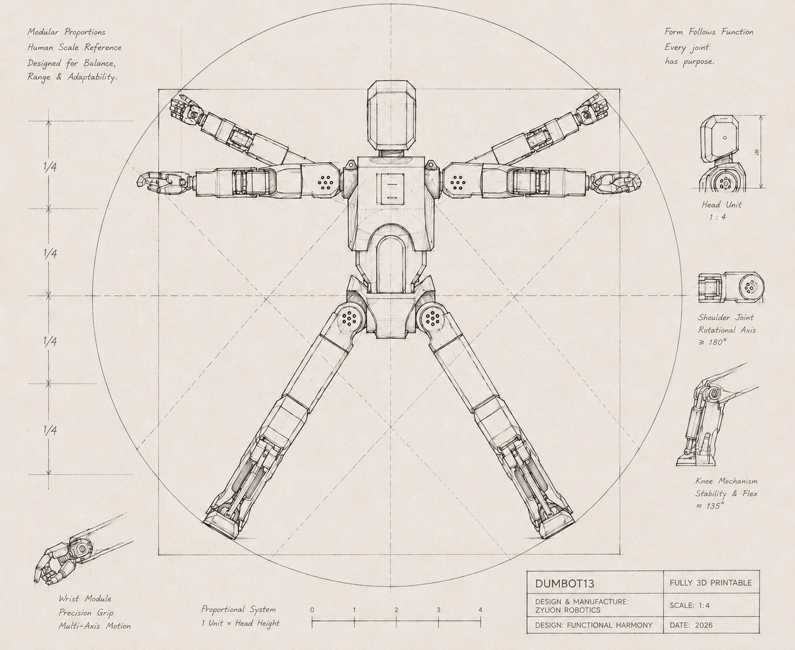
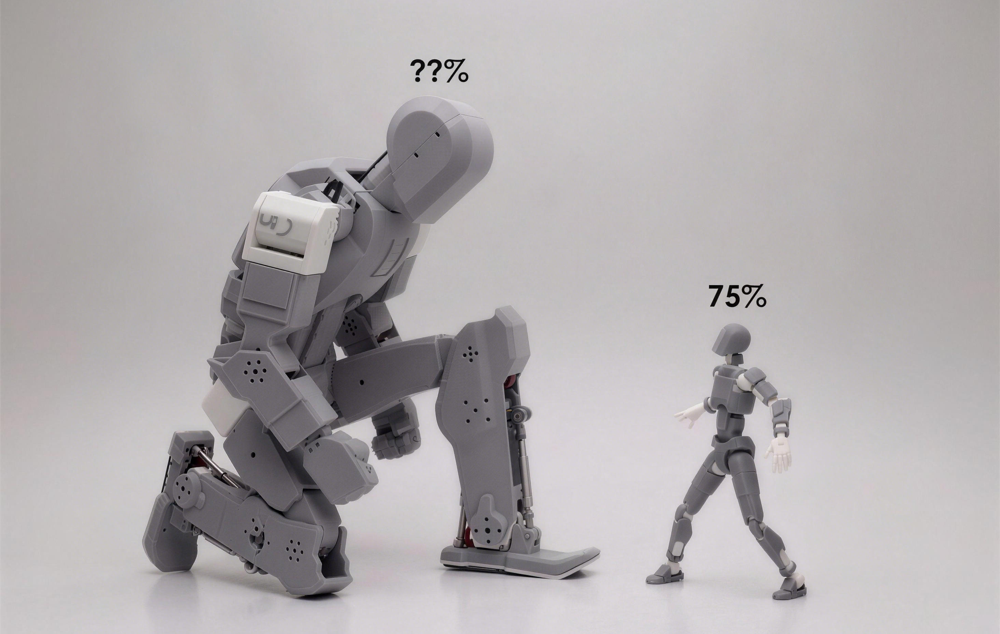
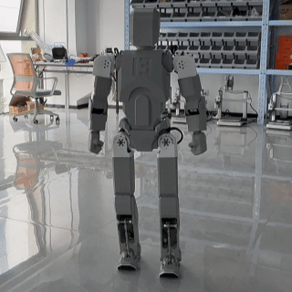
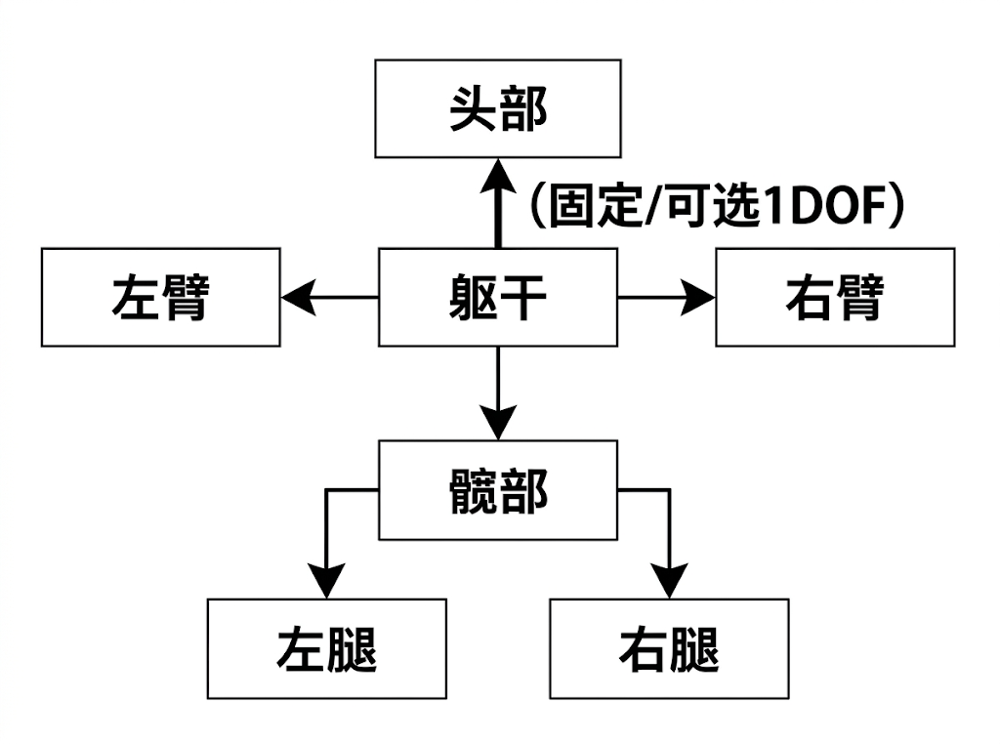
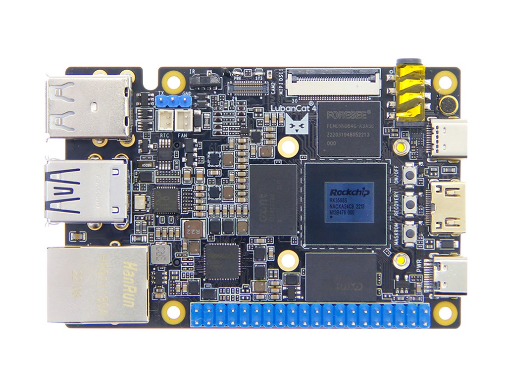
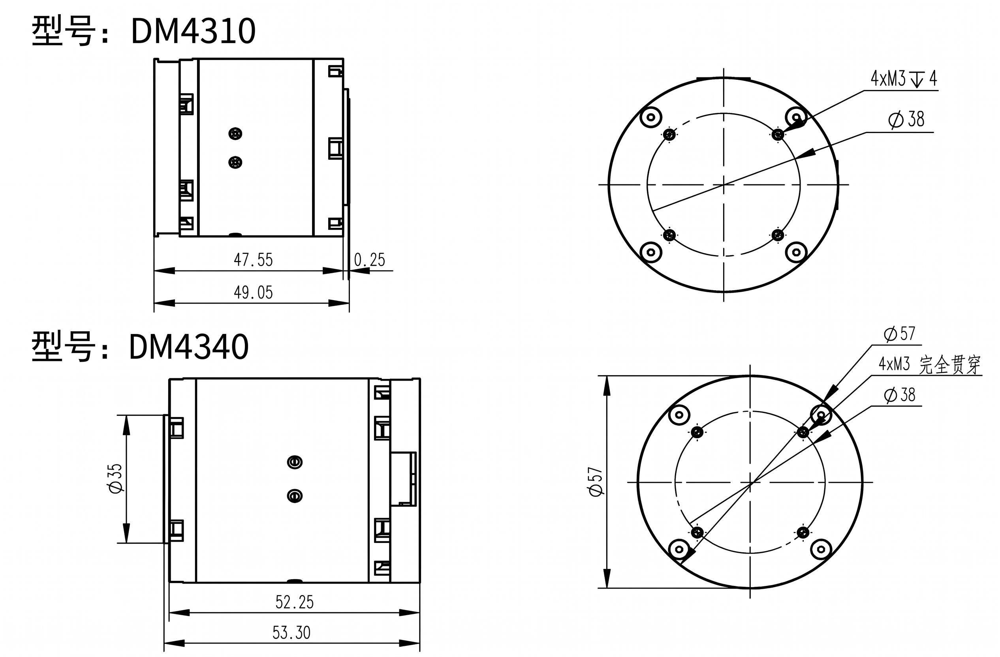

# DumBot13 - 开源3D打印人形机器人

**全3D打印人形机器人平台 | 仅需拓竹A1即可完成 | 极致的性价比**

由 [追远机器人（Zyuon Robotics）](https://github.com/zyuon-robotics) 设计并开源

拓竹MakerWorld项目：[DumBot13-Makerworld](https://makerworld.com.cn/zh/models/2516791-dumbot13)

## 目录

- [项目简介](#项目简介)
- [为什么选择本项目？](#为什么选择本项目)
- [快速开始](#快速开始)
- [机器人规格概览](#机器人规格概览)
- [机械设计详解](#机械设计详解)
  - [整体架构](#整体架构)
  - [躯干模块](#躯干模块torso)
  - [髋部/腰部模块](#髋部腰部模块pelvis--waist)
  - [腿部模块](#腿部模块legs)
  - [手臂模块](#手臂模块arms)
  - [头部模块](#头部模块head)
  - [非3D打印零件](#非3d打印零件)
- [嵌入式系统与电控](#嵌入式系统与电控)
- [成本概览](#成本概览)
- [开源软件生态](#开源软件生态)
- [常见问题](#常见问题)
- [贡献与致谢](#贡献与致谢)
- [许可证](#许可证)
- [English Summary](#english-summary)

## 项目简介

**DumBot13** 是由追远机器人（Zyuon Robotics）从零设计并全面开源的人形机器人平台。

与市面上绝大多数依赖昂贵机加工的方案不同，DumBot13 实现了**超 99% 的结构件全 3D 打印化**。从承重骨架到仿生外壳，从髋关节到复杂脚踝，全机超 80 个独立结构零件均可通过最普及的 **消费级 FDM 3D 打印机** 轻松制造。我们在将硬件制造门槛降到极致的同时，通过巧妙的结构设计，依然保障了机器人复杂运动控制所需的结构刚性。

我们的核心理念是："用更低的成本，做更完整的事"。当前开源人形机器人社区往往面临两个极端：
*  **成本高昂：** 动辄数万元的造价，将大多数开发者、学生和研究者拒之门外。
*  **完成度低：** 仅有基础的行走 Demo，缺乏可供调用的底层控制与上层软件生态。

**DumBot13 致力于打破这一僵局。**

我们的终极目标是：让**任何拥有一台 3D 打印机的开发者**，都能以颠覆性的低成本，亲手复刻出一台软硬件高度完整的人形机器人。配合我们同步开源的完整软件架构，您可以跳过繁琐的造轮子阶段，直接进入二次开发，尽情探索步态算法验证、软硬件解耦设计以及具身智能的无限可能。

|  |  |  |
| :---: | :---: | :---: |
| 抱拳 | 户外行走 | 挥手 |

## 快速开始

> 以下是组装一台完整 DumBot13 所需的核心步骤概述，各步骤链接到下方对应章节获取详细信息。

### 1. 购买材料

TODO：添加BOM表

### 2. 打印零件

前往 MakerWorld 下载全部打印文件：[DumBot13-Makerworld](https://makerworld.com.cn/zh/models/2516791-dumbot13)

- 所有零件均适配 256mm³ 打印幅面，**单台拓竹A1即可完成全部打印**
- 推荐使用 PETG 材料，详见 [极致的3D打印适配](#极致的3d打印适配)

### 3. 组装

按照以下顺序组装（详见 [机械设计详解](#机械设计详解)）：

1. **躯干模块** — 打印骨架+外壳，安装主控和电池仓
2. **髋部/腰部模块** — 安装腰部电机和髋部连接件
3. **腿部模块** — 安装大腿、小腿、踝关节电机及连杆传动
4. **手臂模块** — 安装肩部、上臂、小臂和拳头
5. **头部模块** — 安装外壳和传感器（可选）

> 预算有限或仅需验证腿部算法？可采用 **仅组装下半身** 方案，详见 [灵活的组装方案](#灵活的组装方案)。

### 4. 部署软件

在鲁班猫4上克隆[humanoid-control](https://github.com/ZyuonRobotics/humanoid-control) 代码库，配置Docker镜像并执行指令。

详见 [开源软件生态](#开源软件生态)。

## 为什么选择本项目？

### 极致的3D打印适配

本项目致力于填补DIY社区中人形机器人的空白，因此从设计的第一天起，我们就将"可打印性"作为最高优先级：

- **优化结构设计**：所有零件均针对3D打印的成型工艺进行优化，提升打印成功率并降低装配难度
- **仅需A1即可完成**：所有零件均适配256mm³以内的打印幅面，理论上使用**单台拓竹A1**即可完成全部打印（开发过程中我们同时使用了P2S和X2D以提高效率，但并非必需）
- **100% Bambu Lab生态**：全部零件的切片和测试均在拓竹P2S、X2D和A1上完成，提供的3MF文件已针对拓竹打印机优化

**打印机兼容性测试：**

| 打印机型号 | 兼容性 | 备注 |
|-----------|--------|------|
| **拓竹 A1** | ✅ 完全兼容 | 所有零件均可单机完成，打印幅面完全满足需求 |
| **拓竹 P2S** | ✅ 完全兼容 | 开发主力机之一 |
| **拓竹 X2D** | ✅ 完全兼容 | 开发主力机之一 |
| 其他拓竹机型 | ✅ 理论兼容 | 本项目未在非Bambu Lab机型上测试 |

> 本项目针对256×256×256mm的打印幅面进行优化，可以使用一台A1完成整个机器人的打印（但需要足够的耐心）。

### 极高的完成度

本项目不是一个“仅能维持站立平衡”的 Demo 级尝试，而是一套打通了从硬件设计到算法部署全链路的完备生态。我们的开源内容完整覆盖：

| 维度 | 内容 |
|------|------|
| **机械本体设计** | 完整的人形结构，含头部、躯干、双臂、双腿，共计20+个自由度（具体数量见下方规格） |
| **3D打印文件** | 预配置3MF文件 + STEP工程源文件，开箱即用 |
| **嵌入式固件** | 电源、控制与通信板的PCB与代码 |
| **强化学习训练代码** | [humanoid-env 训练框架](https://github.com/ZyuonRobotics/humanoid-env) |
| **实物部署代码** | [humanoid-control 部署框架](https://github.com/ZyuonRobotics/humanoid-control) |

得益于如此全栈且模块化的完成度，无论你是算法研究员、硬核创客还是嵌入式开发者，都能在本项目中快速找到切入点，专注于你的个性化定制与二次开发。

### 难以置信的性价比

相比市面上现有的开源人形机器人项目，本项目的硬件成本实现了数量级上的显著降低。其核心成本主要聚焦于主控与伺服电机两大关键组件（详见 [成本概览](#成本概览)），而以往高昂的机械结构成本，则通过3D打印技术得以完美化解。在此基础上，我们通过持续的软硬件协同优化与算法迭代，在极低成本的边界限制下，成功实现了高度灵活且拟人化的机器人运动控制。

### 灵活的组装方案

如果你的预算有限，或者现阶段只想专注于验证腿部运动算法，完全可以采用**仅组装下半身（双腿+髋部）**的轻量化方案，从而大幅节省手臂电机的硬件成本。这种模块化的构型灵活性，是传统固定形态机器人所无法比拟的。此外，得益于全结构件开源与3D打印技术，你可以极其轻松地扩展个性化设备（如各类传感器），为多元化的项目开发提供无限可能。

## 机器人规格概览

| 参数 | 数值 |
|------|------|
| **自由度总数** | 21/23DOF |
| 腿部自由度 | 每条腿6个DOF |
| 手臂自由度 | 每条手臂4-5个DOF |
| 腰部自由度 | 1个DOF |
| 头部自由度 | 暂无（未来1DOF） |
| **高度** | 约120cm |
| **重量** | 约17kg |
| **驱动方式** | 达妙（DM）无刷伺服电机 (4310 / 4340) |
| **主控制器** | 鲁班猫4（LubanCat 4） |
| **结构材料** | PETG |
| **非打印件** | 摆杆（CNC铝合金）、连杆（成品件）、紧固件、轴承 |
| **兼容打印机** | 拓竹 A1 / P2S / X2D（推荐，其余拓竹机型均可） |

## 机械设计详解

### 整体架构

机器人以**躯干**为核心，采用经典的**串联关节式人形架构**。躯干作为中枢连接以下模块：

- **向上**：连接头部
- **向两侧**：连接左臂和右臂
- **向下**：连接髋部，髋部再分别连接左腿和右腿

#### 腿部关节与电机配置

每条腿包含 **3个关节**，由 **6个电机** 驱动（共6DOF）：

| 关节 | 电机数量 | 运动形式与电机型号 |
|------|---------|---------|
| **髋关节 (Hip)** | 3 | Pitch (DM4340) + Roll (DM4340) + Yaw (DM4310) |
| **膝关节 (Knee)** | 1 | Pitch (DM4340) |
| **踝关节 (Ankle)** | 2 | Pitch (DM4340) + Roll (DM4340) |

> 运动链：**髋关节 → 大腿 → 膝关节 → 小腿 → 踝关节 → 脚板**

#### 手臂关节与电机配置

每条手臂包含 **3个关节**，由 **4~5个电机** 驱动（4~5DOF）：

| 关节 | 电机数量 | 运动形式与电机型号 |
|------|---------|---------|
| **肩关节 (Shoulder)** | 3 | Pitch (DM4310) + Roll (DM4310) + Yaw (DM4310) |
| **肘关节 (Elbow)** | 1 | Pitch (DM4310) |
| **腕关节 (Wrist)** | 1（可选） | Roll (DM4310) |

> 运动链：**肩关节 → 上臂 → 肘关节 → 腕关节（可选） → 拳头**

以下按模块逐一介绍。

### 躯干模块（Torso）

躯干是机器人的核心结构，承载着主控制器、电池和上半身的所有负载。我们的躯干采用**骨架+外壳**的分层设计：

- **躯干骨架（前/后）**：承力结构，采用100%填充或4层40%填充打印，将所有关节的反作用力均匀分布
- **躯干外壳（1-4号）**：装饰性/防护性外壳，可根据个人喜好使用不同颜色的耗材打印
- **角码**：共5种角码零件，用于连接和加固躯干各面的接合处
- **电池仓组件**：集成于躯干内部，设有专用电池固定架，方便快速更换电池

### 髋部/腰部模块（Pelvis & Waist）

髋部模块是机器人全身受力最大的区域——它承担着整个上半身的重量，同时为双腿提供Pitch方向旋转自由度。

- **腰部结构**：提供躯干的偏航（Yaw）旋转，内置深沟球轴承支撑（我们通过结构设计优化省去了对交叉滚子轴承的依赖），由4340电机驱动
- **髋部大腿连接件**：固定驱动腿部Pitch方向旋转的电机，将髋部与下肢连接
- **髋关节前/后壳**：包裹髋部关节组件，前壳和后壳对夹紧固

### 腿部模块（Legs）

每条腿包含6个自由度，从髋部到脚踝构成完整的串联运动链。我们通过简化结构设计，大幅减少了零件数量和装配复杂度：

- **大腿**：单一结构件，一次打印成型。整合了膝关节电机安装位和髋关节连接结构，减少了多零件拼接带来的误差积累
- **小腿**：单一结构件，一次打印成型，是腿部结构最复杂的部件。小腿内部的踝关节Pitch方向电机通过**连杆**传动：
  - 连杆两端连接**鱼眼轴承**，上端通过**摆杆**连接踝关节Pitch方向电机，下端连接踝关节Roll方向电机
  - 这种连杆+鱼眼轴承的传动方式有效降低了装配精度要求，同时保障了关节运动的平顺性
- **脚板组件**：包含脚底板、脚后跟及提耳等零件，通过踝关节Roll方向电机与小腿连接

腿部分为左腿和右腿两组，结构完全对称。每条腿仅需大腿、小腿两个主体结构件即可完成装配，极大降低了打印和组装门槛。

### 手臂模块（Arms）

每条手臂包含4~5个自由度。与腿部一样，手臂同样采用简化的结构设计：

- **肩部组件**：连接躯干与手臂，包含肩关节的Pitch和Roll方向电机
- **上臂**：单一结构件，一次打印成型，连接肩部与肘关节，内置肘关节Pitch方向电机安装位
- **小臂**：单一结构件，预留腕关节Roll方向电机安装位（可选装）
- **拳头**：末端执行器，3D打印成型。可以自由更换成其他形态

手臂同样为左右对称结构。

### 头部模块（Head）

头部采用两片式外壳设计，内部可安装小型传感器或摄像头模块。当前版本头部无伺服驱动自由度。如有需要，可简单改造加装一个Yaw自由度。

### 非3D打印零件

虽然本项目绝大部分零件可以3D打印，但仍有少量零件需要额外获取：

| 零件 | 加工方式 | 说明 |
|------|---------|------|
| **摆杆** | CNC加工（铝合金） | 连接踝关节Pitch电机输出轴与鱼眼轴承，需要较高强度和精度，可在嘉立创等平台以较低价格制作 |
| **连杆** | 成品件（标准件） | 部分关节的辅助连杆，市售标准件即可 |
| **紧固件** | 标准件 | M3/M4螺栓、螺母、垫片等 |
| **轴承** | 标准件 | 深沟球轴承等标准规格轴承 |

## 嵌入式系统与电控

### 主控制器：鲁班猫4（LubanCat 4）

鲁班猫4是一款基于瑞芯微RK3588的国产高性能单板计算机，为机器人提供强大的算力支持：

- **CPU**：四核Cortex-A76 + 四核Cortex-A55
- **NPU**：6 TOPS算力，支持端侧AI推理
- **接口**：丰富的GPIO、UART、CAN、SPI，完美满足机器人控制需求
- **操作系统**：支持Ubuntu/Debian，可直接运行ROS 2

我们使用外接RTL8822CE实现主控的无线网络通信，此外需要购入mini pcie半高转全高支架。

### 驱动电机：达妙（DM）无刷伺服电机

本项目使用达妙系列的无刷伺服电机，共两种型号：

| 型号 | 用途 | 数量（全身） | 数量（仅腿部） |
|------|------|-------------|-------------|
| **DM4340** | 髋关节、膝关节等大扭矩关节 | 10个 | 10个 |
| **DM4310** | 肩关节、肘关节、踝关节等 | 11个 | 2个 |

> **购买链接**：[达妙4310电机](https://item.taobao.com/item.htm?id=815333472865)
> **购买链接**：[达妙4340电机](https://item.taobao.com/item.htm?id=814943831981)

达妙电机支持CAN总线通信，具有高精度位置反馈、力矩控制和高速响应能力，是机器人关节驱动的理想选择。

### 电控架构图

<!-- TODO: 待添加电控架构框图 -->

## 成本概览

本项目的硬件成本极具竞争力，完整机器人的总成本可以控制在18000元之内。以下为大致成本构成（单位：人民币）：

| 项目 | 型号/规格 | 大致成本 | 备注 |
|------|----------|---------|------|
| **主控制器** | 鲁班猫4 | 1200 元 | 最大单项支出 |
| **can通信板** | DM-MC02机器人开发版 | 200 元 | 可使用其他通信方案，支持超过3路FDCAN即可 |
| **电机 ×21** | DM4340 ×10 + DM4310 x11 | 14600 元 | 核心成本，可选腿部方案减少数量 |
| **电源板** | 嘉立创打样 | 200元 | 需手动焊接，未来考虑委托售卖 |
| **3D打印耗材** | PETG ~8-10kg | 约300元 | 极低的制造成本 |
| **CNC加工** | 摆杆（铝合金） | 约100元 | 仅此件需要外加加工 |
| **紧固件与轴承** | 标准件 | 约200元 | 标准件成本极低 |
| **电池** | 48v | 600 元 | 可联系淘宝商家制作 |
| **其他** | 连杆、导线、连接器等 | 约100元 | |

> **组装腿部方案成本**：如果仅组装下半身（双腿+髋部），可减少手臂所需的8个DM4310电机，成本显著降低。

**与同类开源人形机器人项目对比**，本项目的总成本约为其1/3到1/5，是当前最具性价比的开源人形机器人方案。

## 开源软件生态

本项目的开源不仅停留在机械设计层面，我们提供了完整的软件栈：

<!-- TODO: 待添加软件架构图 -->

### 软件仓库

| 模块 | 描述 | 链接 |
|------|------|------|
| **控制框架** | 基于ROS 2的机器人控制框架，包含关节控制、运动指令等 | https://github.com/ZyuonRobotics/humanoid-control |
| **训练框架** | 纯RL行走、BeyondMimic等训练环境 | https://github.com/ZyuonRobotics/humanoid-env |
| **重定向框架** | 从SMPL、BVH等动捕格式重定向到任意机器人构型 | https://github.com/ZyuonRobotics/humanoid-retargeting |
| **机器人描述格式** | 自定义HRDF格式，针对人形机器人重新设计 | https://github.com/ZyuonRobotics/humanoid-robot-description |

## 常见问题

**Q: 必须用拓竹的打印机吗？**
A: 我们的测试和优化均在拓竹机器上完成，理论上其他FDM打印机也可以，但可能需要自行调整参数。我们强烈推荐使用拓竹机器以确保最佳效果。

**Q: 单台A1真的够用吗？**
A: 是的。所有零件均控制在256mm³以内，单台A1足以完成全部打印。我们关于幅面的承诺经过了充分验证。

**Q: 摆杆不CNC可以吗？**
A: 不建议。摆杆是传递电机扭矩的关键受力件，3D打印件的层间结合力在连续高扭矩下难以满足要求。CNC铝合金摆杆的成本很低（嘉立创、铨洲等平台几十元即可加工）。

**Q: 可以用PLA打印吗？**
A: 可以用于原型验证。但长期使用时PLA的蠕变特性会导致关节松动，建议最终使用PETG或ABS。

**Q: 如何获取技术支持？**
A: 目前可以在本项目的issue区进行提问，我们后续会建立官方的微信讨论群。

## 贡献与致谢

本项目由 **追远机器人（Zyuon Robotics）** 设计开发。

欢迎通过以下方式参与贡献：
- 提交Issue反馈问题和建议
- 提交Pull Request改进设计
- 分享你的组装过程和创意修改

## 许可证

本项目机械设计文件采用[CC BY-NC-SA 4.0](https://creativecommons.org/licenses/by-nc-sa/4.0/)进行开源。

软件代码仓库分别遵循各自的许可证，详见各GitHub仓库。
